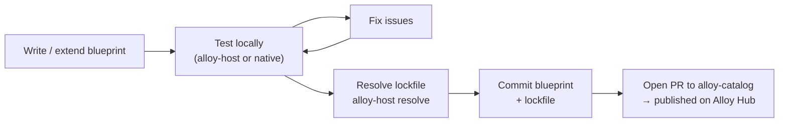

# Developing Blueprints

A **blueprint** is a small directory of YAML files that completely defines a build environment. Write it once, use it anywhere: natively on Linux, in a VM, in a Docker image, on CI.

---

## What a blueprint contains

```
my-arm-env/
├── manifest.yml        # required: name, version, variables, task order
├── variables.yml       # optional: shared variable definitions
├── 00-system.yml       # task file: base OS packages
├── 10-toolchain.yml    # task file: ARM GCC toolchain
├── 20-environment.yml  # task file: env vars and config
└── alloy.lock.yml      # generated: pinned URLs and SHA256 checksums
```

The provisioner reads `manifest.yml` to know the order, then executes each task file in sequence. Task files are independent, idempotent, and re-runnable.

---

## Two ways to get started

<div class="grid cards" markdown>

-   :material-download: **Extend from Alloy Hub**

    ---

    Start with a community blueprint from [Alloy Hub](https://alloy-it.io) and customize it for your project. The fastest path if a similar environment already exists.

    [Extend from Alloy Hub &rarr;](extending.md)

-   :material-pencil: **Write from scratch**

    ---

    Define your environment from the ground up. Follow the step-by-step guide to create a manifest, write task files, and test locally.

    [Write from scratch &rarr;](from-scratch.md)

</div>

---

## The blueprint development lifecycle



1. **Write** your manifest and task files.
2. **Test** by provisioning into a local VM or running alloy-provisioner natively.
3. **Resolve** the lockfile to pin toolchain URLs and checksums.
4. **Commit** the blueprint and lockfile to your repo.
5. **Publish** by opening a PR to the alloy-catalog repo; automated checks run, and on merge it appears on Alloy Hub.

---

## In this section

| Page | What you'll learn |
|---|---|
| [Blueprint Structure](structure.md) | manifest.yml, task files, run_order, lockfile |
| [Variables & Configuration](variables.md) | Manifest vars, variables.yml, .env files, required_env |
| [The Layers Approach](layers.md) | How to split a blueprint into maintainable layers |
| [Extend from Alloy Hub](extending.md) | Start from an existing blueprint and customize |
| [Write from Scratch](from-scratch.md) | Step-by-step: manifest → task files → test → publish |
| [Publishing to Alloy Hub](publishing.md) | PR to alloy-catalog → availability on Alloy Hub |
