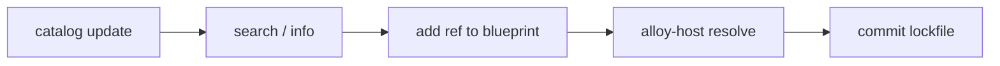

# Available Toolchains

---

## Alloy Hub and the catalog

**[Alloy Hub](https://alloy-it.io)** is the web-facing registry for community-maintained blueprints and toolchains. Browse and install environments directly from there, or use the command line.

The **catalog** is the metadata store that backs Alloy Hub. It does not store binaries; it stores toolchain IDs, versions, download URLs, and SHA256 checksums per host platform (`linux/amd64`, `linux/arm64`). The catalog lives in the **alloy-catalog** GitHub repository and is synced locally by `alloy-host catalog update`.

---

## How blueprints use the catalog

Blueprints declare which tools they need using **refs** (e.g. `toolchain.arm-gnu.arm-none-eabi@stable`). The catalog defines what those refs mean: the actual download URL and SHA256 for each supported architecture.

When you run `alloy-host resolve`, alloy-host looks up each ref in the local catalog and writes `alloy.lock.yml` with pinned URLs and checksums. The provisioner uses the lockfile to download exact artifacts, reproducibly.

This means: blueprints say "I need this tool at this version"; the catalog says "here is where to get it and how to verify it"; the lockfile records the resolved result.

---

## Why it scales

One catalog entry is maintained once and consumed by many blueprints and teams. You do not copy URLs and checksums into every project; you reference a catalog ID. When a new toolchain version is added, any blueprint using `@stable` can pick it up by re-running `alloy-host resolve`.

---

## Workflow: using the catalog in a blueprint



| Step                      | Command                                                                      |
| ------------------------- | ---------------------------------------------------------------------------- |
| 1. Update catalog         | `alloy-host catalog update`                                                  |
| 2. Find an entry          | `alloy-host catalog search <term>` then `alloy-host catalog info <id>`       |
| 3. Reference in blueprint | Add `toolchains:` in `manifest.yml` or use `unarchive_from_ref` in task file |
| 4. Resolve                | `alloy-host resolve` → writes `alloy.lock.yml`                               |
| 5. Commit lockfile        | Commit `alloy.lock.yml` for reproducibility                                  |

---

## Keeping the catalog up to date

```bash
alloy-host catalog update
```

This clones or pulls the latest catalog into `~/.alloy-it/catalog/`. Run this before searching or resolving.

---

## Browsing the catalog

```bash
alloy-host catalog search arm
alloy-host catalog search nordic
alloy-host catalog search golang
```

To see all versions of a specific entry:

```bash
alloy-host catalog info toolchain.arm-gnu.arm-none-eabi
alloy-host catalog info sdk.golang.go
```

Or browse directly on [Alloy Hub](https://alloy-it.io).

---

## Reference format

Catalog entries are referenced using dotted IDs with an optional version or alias:

```
toolchain.arm-gnu.arm-none-eabi@stable
toolchain.arm-gnu.arm-none-eabi@13.3.rel1
sdk.golang.go@stable
tool.nordic.nrf-command-line-tools@stable
```

Use `@stable` to always resolve to the latest stable release, or pin to a specific version number. The resolved version is recorded in `alloy.lock.yml` when you run `alloy-host resolve`.

---

## Available entries

!!! note
    The catalog is updated independently of this documentation. Run `alloy-host catalog search` or browse [Alloy Hub](https://alloy-it.io) for the current list. The entries below reflect what is available at the time of writing.

### ARM toolchains

| Catalog ID                                   | Description                                |
| -------------------------------------------- | ------------------------------------------ |
| `toolchain.arm-gnu.arm-none-eabi`            | ARM GNU Toolchain (bare metal, Cortex-M/R) |
| `toolchain.arm-gnu.arm-none-linux-gnueabihf` | ARM GNU Toolchain (Linux, 32-bit)          |
| `toolchain.arm-gnu.aarch64-none-linux-gnu`   | ARM GNU Toolchain (Linux, 64-bit)          |

### SDKs and runtimes

| Catalog ID      | Description             |
| --------------- | ----------------------- |
| `sdk.golang.go` | Go programming language |

### Vendor tools

| Catalog ID                           | Description                   |
| ------------------------------------ | ----------------------------- |
| `tool.nordic.nrf-command-line-tools` | Nordic nRF Command Line Tools |

---

## Using a catalog entry in a blueprint

Declare catalog references in `manifest.yml`:

```yaml
toolchains:
  - ref: toolchain.arm-gnu.arm-none-eabi@stable
    alias: ARM_GCC # injects ARM_GCC_URL and ARM_GCC_SHA as variables
```

Or use `unarchive_from_ref` directly in a task file:

```yaml
- name: Install ARM GNU toolchain
  action: unarchive_from_ref
  ref: toolchain.arm-gnu.arm-none-eabi@stable
  dest: /opt/arm-none-eabi
  strip_components: 1
  creates: /opt/arm-none-eabi/bin/arm-none-eabi-gcc
```

Then generate the lockfile:

```bash
alloy-host resolve
```

---

## Contributing a toolchain

To add a new toolchain to the catalog and make it available on Alloy Hub, see [Publishing to Alloy Hub](../blueprints/publishing.md).
