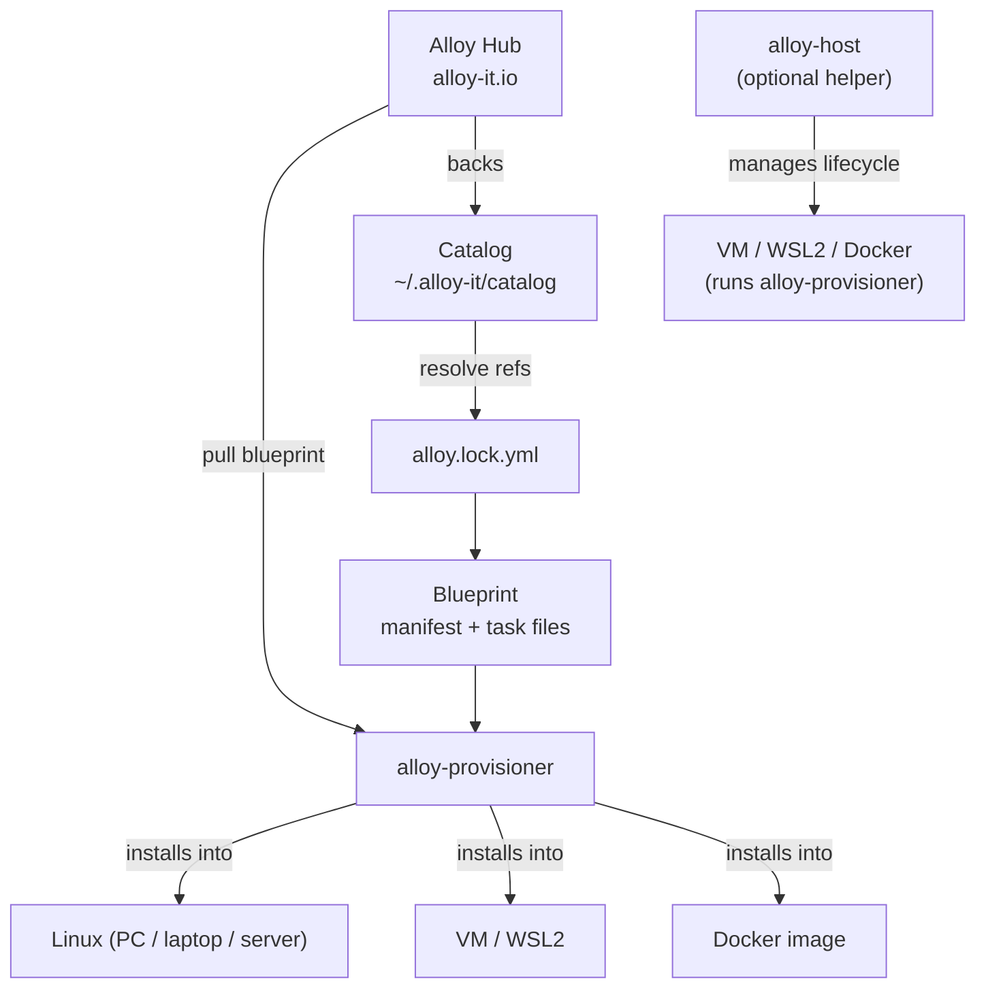

# How Alloy Works

This page gives you the full mental model: what a blueprint is, how alloy-provisioner installs it, where Alloy Hub fits in, and what alloy-host adds on top.

---

## Blueprint

A **blueprint** is a small directory of YAML files that completely defines a build environment. It declares which tools to install, which versions, where they come from, and how to configure them.

The same blueprint runs everywhere:

- **Natively on Linux**: run alloy-provisioner directly on a PC, laptop, or server, a test rack, or any existing Linux VM.
- **In a managed VM**: alloy-host spins up a VM (VirtualBox, WSL2, or Docker) and runs the provisioner inside it.
- **In a Docker image**: embed alloy-provisioner in a Dockerfile to build reproducible CI base images.
- **On CI runners**: the exact same blueprint and lockfile give your pipeline the same environment as every developer.

Blueprints are version-controlled and committed alongside source code. Update the toolchain by changing the blueprint; everyone re-runs the provisioner and gets the same result.

---

## alloy-provisioner

**alloy-provisioner** is the core engine. It is the tool that actually installs the environment.

It runs **inside** any Linux system (PC, laptop, or server, VM, WSL2, or Docker container) and:

- Reads the blueprint (manifest + task files) and the lockfile.
- Executes each task in the declared order: install packages, download toolchains, write env files, run custom commands.
- Uses three layers of idempotency so re-runs skip work that is already done.
- Can pull a blueprint directly from **Alloy Hub** or use a local directory.

You can invoke alloy-provisioner directly:

```bash
# Pull a blueprint from Alloy Hub and provision
alloy-provisioner install community/arm-none-eabi

# Provision from a local blueprint directory
alloy-provisioner --blueprint-dir /path/to/blueprint
```

This is the same binary that alloy-host installs and runs inside VMs and containers.

---

## Alloy Hub

**Alloy Hub** ([alloy-it.io](https://alloy-it.io)) is the public registry for community-maintained blueprints. Browse and search for ready-made environments covering common embedded toolchains, SDKs, and development tools.

You can also browse the catalog locally with alloy-host:

```bash
alloy-host catalog update
alloy-host catalog search arm
alloy-host catalog info toolchain.arm-gnu.arm-none-eabi@stable
```

Blueprints published to Alloy Hub are backed by the **alloy-catalog** repository on GitHub. The catalog stores metadata (IDs, versions, download URLs, and SHA256 checksums), not binaries.

---

## alloy-host

**alloy-host** is an optional helper tool for **developer workstations**. It does not provision environments itself. It manages the lifecycle of local VMs and Docker containers so that alloy-provisioner can run inside them.

Use alloy-host when you want to:

- Isolate your build environment from your host machine.
- Switch between multiple environments for different projects.
- **Test a blueprint** before publishing, without manually setting up a VM.

alloy-host supports three backends:

| Backend              | Platforms             | Use case                           |
| -------------------- | --------------------- | ---------------------------------- |
| VirtualBox + Vagrant | Windows, macOS, Linux | Default; full VM isolation         |
| WSL2                 | Windows               | Fast Linux environments on Windows |
| Docker               | All platforms         | Lightweight containers             |

!!! note
    Any VM managed by your own tools (Vagrant, VirtualBox, Proxmox, etc.) can run alloy-provisioner natively once it has a Linux OS. alloy-host is a convenience wrapper, not a requirement.

---

## Catalog

The **catalog** is a versioned metadata registry for toolchains and SDKs. It stores IDs, versions, download URLs, and SHA256 checksums per host architecture, not the binaries themselves.

**How blueprints use the catalog**

Blueprints declare which tools they need using **refs** (e.g. `toolchain.arm-gnu.arm-none-eabi@stable`). Running `alloy-host resolve` turns those refs into concrete URLs and checksums and writes `alloy.lock.yml` next to the blueprint. The provisioner uses the lockfile to download the exact artifacts, reproducibly.

**Why it scales**

- One catalog entry is maintained once and reused by any number of blueprints and teams.
- Updating a toolchain means updating the catalog entry and re-resolving; everyone gets the same artifact with no copy-pasting of URLs.

---

## Architecture at a glance



---

## Common workflows

| Goal                                                                    | Where to go                                         |
| ----------------------------------------------------------------------- | --------------------------------------------------- |
| **Install an environment** (native Linux, VM, or Docker)                | [Get Started](get-started/index.md)                 |
| **Use alloy-host** (spin up a managed VM on your workstation)           | [With Alloy Host](installing/with-alloy-host.md)    |
| **Bake a blueprint into a Docker image**                                | [In a Docker Image](installing/in-docker.md)        |
| **Write your own blueprint** (from scratch or extending from Alloy Hub) | [Developing Blueprints](blueprints/index.md)        |
| **Publish to Alloy Hub** (open a PR to alloy-catalog)                   | [Publishing to Alloy Hub](blueprints/publishing.md) |
| **Browse toolchains** (ARM GCC, Nordic nRF, Go, and more)               | [Available Toolchains](catalog/index.md)            |

---

## Next steps

- [Choose your installation path](get-started/index.md)
- [Browse blueprints on Alloy Hub](https://alloy-it.io)
- [Write your own blueprint](blueprints/index.md)
