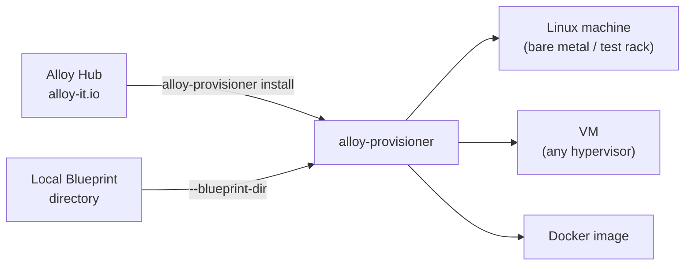

# Installing Environments

## The core idea

**alloy-provisioner** is a single binary that reads a blueprint and installs a complete build environment into any Linux system. The same blueprint, the same result, regardless of whether the target is a bare-metal server, a VM created by any tool, or a Docker container.



## What alloy-provisioner does

Given a blueprint directory, alloy-provisioner:

1. Reads `manifest.yml` to understand variables, toolchain refs, and task order.
2. Executes each task file in the declared order (install packages, download toolchains, write env files, run commands).
3. Tracks what it has done in `alloy.state.yml` so re-runs skip completed tasks.
4. Verifies every downloaded file against its SHA256 checksum.

All three installation paths below use the same provisioner. There is no difference in the resulting environment.

## Blueprints from Alloy Hub

[Alloy Hub](https://alloy-it.io) hosts community-maintained blueprints. You can pull and install them in one step:

```bash
alloy-provisioner install community/arm-none-eabi
```

Or search the catalog locally:

```bash
alloy-host catalog update
alloy-host catalog search arm
```

## Choose your path

| Path                                  | When to use                                                                    |
| ------------------------------------- | ------------------------------------------------------------------------------ |
| [On Linux (Native)](native.md)        | Bare metal, test rack, existing VM, WSL2: any Linux system you already manage |
| [With Alloy Host](with-alloy-host.md) | Developer workstation: isolate environments without touching the host         |
| [In a Docker Image](in-docker.md)     | Replace complex Dockerfiles with a declarative blueprint; CI base images       |

For provisioner subcommands and flags (`install`, `clone`, `--blueprint-dir`, etc.), see [Provisioner CLI](../reference/provisioner-commands.md).
