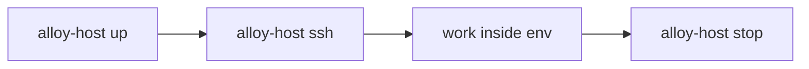

# With Alloy Host

**alloy-host** is a helper tool for developer workstations. It manages the lifecycle of isolated build environments (VMs and Docker containers) so that alloy-provisioner can run inside them, without touching your host machine.

Use alloy-host when you want to:

- Keep your host clean and switch between project environments easily.
- **Test a blueprint** before publishing to Alloy Hub, without manually setting up a VM.
- Give teammates a one-command environment setup.

!!! note
    alloy-host is a helper tool. Any Linux VM/ Container you manage yourself (Vagrant, VirtualBox, wsl2, etc.) can run [alloy-provisioner natively](native.md). alloy-host is not required.

---

## Install alloy-host

The recommended approach is the **bootstrap installer** from [alloy-host-releases](https://github.com/alloy-it/alloy-host-releases) (same idea as the [alloy-provisioner install script](native.md)). It picks the correct OS/architecture, downloads the official archive, and installs the binary. Details: [`scripts/README.md` in alloy-host-releases](https://github.com/alloy-it/alloy-host-releases/blob/main/scripts/README.md).

=== "macOS (Homebrew)"

```bash
brew install alloy-it/tap/alloy-host
```

=== "macOS (bootstrap script)"

```bash
curl -fsSL https://raw.githubusercontent.com/alloy-it/alloy-host-releases/main/scripts/install.sh | bash
```

Installs to `/usr/local/bin` (requires `sudo`). To pin a version: add `| bash -s -- 0.3.0` (use a real tag without `v`).

=== "Linux"

```bash
curl -fsSL https://raw.githubusercontent.com/alloy-it/alloy-host-releases/main/scripts/install.sh | bash
```

Installs to `/usr/local/bin` (requires `sudo`). Pin a version: `…/install.sh | bash -s -- 0.3.0`.

=== "Windows"

Download [`install.ps1`](https://raw.githubusercontent.com/alloy-it/alloy-host-releases/main/scripts/install.ps1), then run:

```powershell
powershell -ExecutionPolicy Bypass -File .\install.ps1
```

By default the script installs under `%LOCALAPPDATA%\alloy-host` and adds that directory to your user `PATH`. Alternatively, download `alloy-host_latest_windows_amd64.zip` or `alloy-host_latest_windows_arm64.zip` from the [latest release](https://github.com/alloy-it/alloy-host-releases/releases/tag/latest), extract, and add the folder to your `PATH`.

Verify:

```bash
alloy-host check-health
```

This confirms alloy-host can find the required backend tools.

---

## Choose a backend

alloy-host supports three backends:

| Backend              | Flag                     | Platforms             | Notes                                     |
| -------------------- | ------------------------ | --------------------- | ----------------------------------------- |
| VirtualBox + Vagrant | `--backend vm` (default) | Windows, macOS, Linux | Requires VirtualBox and Vagrant installed |
| WSL2                 | `--backend wsl2`         | Windows               | Fast; requires WSL2 enabled               |
| Docker               | `--backend docker`       | All                   | Requires Docker installed                 |

**VirtualBox + Vagrant prerequisites** (default backend):

- macOS / Linux: install [VirtualBox](https://www.virtualbox.org/) and [Vagrant](https://www.vagrantup.com/)
- Windows: same, or use WSL2 instead
- Apple Silicon (M1/M2/M3): requires VirtualBox 7.1 or later

---

## Create your first environment

### 1. Initialize

```bash
alloy-host init arm-dev --blueprint community/nordic/nrf91:1.1.3
```

This creates an `arm-dev/` directory with the backend configuration and blueprint reference. The VM does not start yet.

To use a local blueprint instead:

```bash
alloy-host init arm-dev --blueprint ./path/to/blueprint
```

To use WSL2 or Docker:

```bash
alloy-host init arm-dev --blueprint community/nordic/nrf91:1.1.3 --backend wsl2
alloy-host init arm-dev --blueprint community/nordic/nrf91:1.1.3 --backend docker
```

### 2. Start and provision

```bash
cd arm-dev
alloy-host up
```

alloy-host starts the backend, installs alloy-provisioner inside the guest, and runs the blueprint. You'll see each task execute in sequence. The first run downloads toolchains; this takes a few minutes.

When you use the WSL2 or Docker backend, `alloy-host` activates the matching
runtime environment tag for `alloy-provisioner` (`wsl2` or `docker`). This means
blueprint tasks that use `exclude: [wsl2]` or `exclude: [docker]` are skipped
automatically.

```toml
Bringing machine up...
Running provisioner...
✔  Update APT cache
✔  Install build tools
✔  Install ARM GCC toolchain
✔  Configure PATH
Provisioning complete.
```

Running `alloy-host up` again is safe; completed tasks are skipped.

### 3. Enter the environment

```bash
alloy-host ssh
```

You're now inside the VM (or WSL2/Docker container). Your host project directory is mounted at `/vagrant`. Verify the toolchain:

```bash
arm-none-eabi-gcc --version
cmake --version
ninja --version
```

### 4. Stop when done

```bash
alloy-host stop
```

The environment is suspended with everything intact. Resume later with `alloy-host up`.

---

## Daily workflow



```bash
alloy-host up        # start the environment
alloy-host ssh       # open a shell inside it
# ... do your work ...
alloy-host stop      # shut it down when done
```

When inside the environment directory you can omit the name. From anywhere else:

```bash
alloy-host ssh arm-dev
alloy-host up stm32-proj
```

---

## Updating the environment

When your blueprint changes, re-provision the running environment:

```bash
alloy-host provision
```

Only new or changed tasks run. Everything else is skipped.

---

## Managing multiple environments

```bash
alloy-host list
```

Shows all registered environments with status, backend, and blueprint.

---

## Destroying and rebuilding

```bash
alloy-host destroy       # delete the VM (project files on host are not affected)
alloy-host up            # reprovisioned from scratch
```

For a complete clean slate (also wipes the persistent data disk):

```bash
alloy-host destroy --all
alloy-host up
```

---

## Quick reference

| Command                                   | What it does                                |
| ----------------------------------------- | ------------------------------------------- |
| `alloy-host init <name> --blueprint <bp>` | Create environment directory                |
| `alloy-host up [name]`                    | Start or recreate the environment           |
| `alloy-host ssh [name]`                   | Open a shell inside the environment         |
| `alloy-host provision [name]`             | Re-run the blueprint (apply updates)        |
| `alloy-host stop [name]`                  | Suspend the environment                     |
| `alloy-host destroy [name]`               | Delete the environment                      |
| `alloy-host list`                         | Show all registered environments            |
| `alloy-host validate [name]`              | Validate blueprint syntax                   |
| `alloy-host resolve [name]`               | Generate `alloy.lock.yml` from catalog refs |
| `alloy-host check-health`                 | Verify alloy-host is correctly installed    |

Full details: [Command Reference](../reference/commands.md)

---

## Next steps

- [USB device passthrough](../hardware/usb-passthrough.md): attach development boards to your VM
- [Write your own blueprint](../blueprints/index.md)
- [Sharing with your team](../blueprints/publishing.md)
